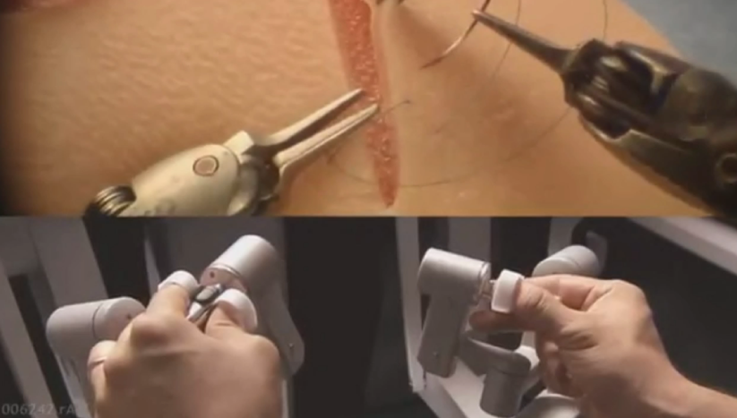
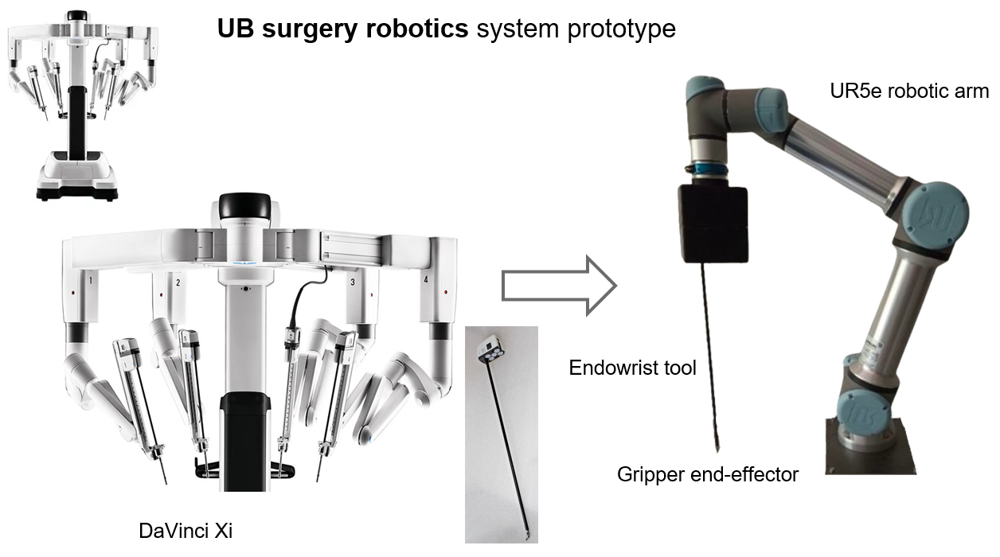
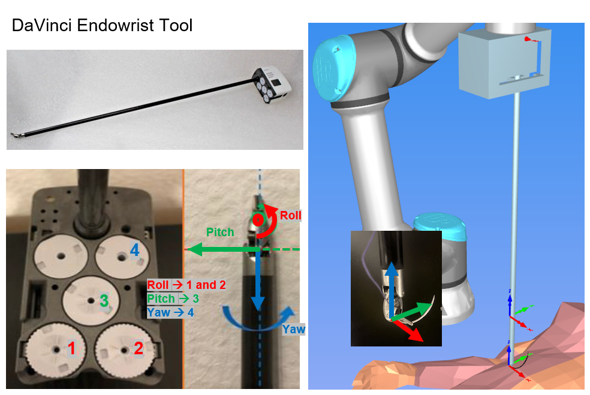
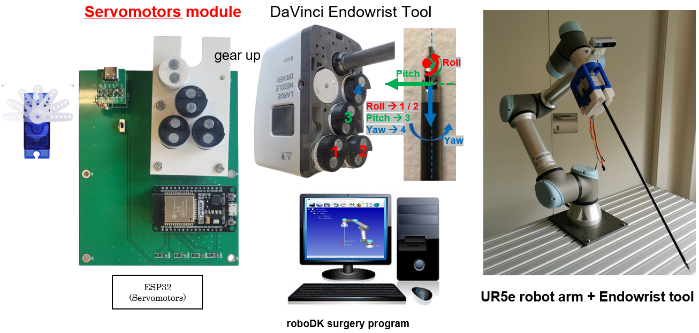
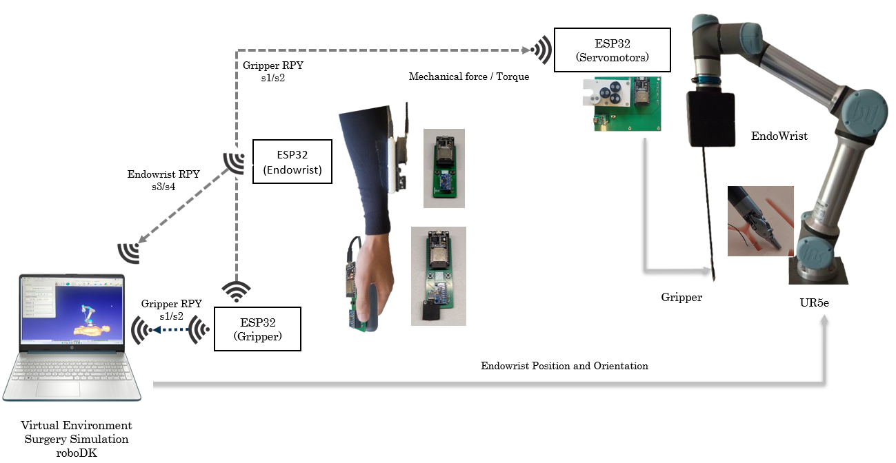

## Degree in Biomedical Engineering
## ROBOTICS AND CONTROL OF BIOMEDICAL SYSTEMS
# **Surgery Robotics Project**
### Laboratory sessions 1 & 2: DaVinci surgery system prototype setup and performances

---

The DaVinci Surgical System is a sophisticated robotic platform that enhances the capabilities of surgeons, enabling them to perform complex, minimally invasive procedures with greater precision and control. 

DaVinci Surgical System is a master-slave system that translates the surgeon's hand movements into the precise actions of miniaturized instruments inside the patient's body. 

The system consists of three main components: 
- a surgeon's console, 
- a patient-side cart with four robotic arms, 
- and a high-definition 3D vision system.

From the ergonomic console, the surgeon views a magnified, high-resolution 3D image of the surgical site, providing a level of detail impossible with the naked eye. 

The surgeon's hand, wrist, and finger movements are translated in real-time to the robotic arms. This technology filters out any hand tremors and scales the surgeon's movements. 

By facilitating smaller incisions, the DaVinci system aims to reduce pain and blood loss, shorten recovery times, and minimize scarring compared to traditional open surgery. It is utilized across a wide range of specialties, including urology, gynecology, and general surgery.

### The objective of this laboratory session will be:
- Develop a simpler prototype of DaVinci system in our Biorobotic's Lab facilities
- Identify the main sensors and actuators needed
- Start with a simple Surgery robotic maneobrability GUI interface
- Identify limitation performances and find useful solutions
- Implement your own improved surgical robotic system

Review this video to see the main performances of a DaVinci surgery system:

Review this video to see an exemple of your final project demonstration:

### Simple DaVinci system prototype in Biorobotics Lab

In Biorobotics lab you will have a simple prototype of DaVinci system based on:
- UR5e robot arm
- Hospital Clinic Endowrist gripper tool
- PCB based control board for GUI interface
- PC for simulation and control real surgery robotic system

The **patient-side cart** is a UR5e robot arm with a Hospital Clinic Endowrist gripper tool. 

The **surgeon's console** is based on:
- an ESP32 based wireless **Endowrist** control board with speciffic sensors to control the UR5e robotic arm.

- an ESP32 based wireless **Gripper** control board with speciffic sensors to control the Endowrist gripper tool.

    - The RPY (Roll, Pitch, Yaw) orientation of the Endowrist tool is controlled by 3 rotating discs on the base of the Endowrist tool:
    
    - An ESP32 based wireless **Servomotors** control board with four SG90 servomotors apply the RPY (Roll, Pitch, Yaw) orientation read from Gripper Module
    

The **Vision and Control cart** is based on a PC with:
- roboDK program for simulation and vision process
- python script program based on sockets to control the robot arm orientation.

A graphical operation of this First simple surgery robotic system prototype is shown in the following figure:

The different modes of operation of the system are:

### Init Hardware-Software setup
The **hardware setup** of the first prototype of the DaVinci surgery system is based on:
- A "Robotics_UB" router: Assigning a fixed IP address to each module (x corresponds to group number)
  - SSID: Robotics_UB
  - Password: 
- Hardware modules:
  - UR5e robot arm with Endowrist tool
  - PC control with roboDK program and python scripts (IP:192.168.1.x5)
  - ESP32 based wireless modules:
    - ESP32 based wireless Gripper control board (IP:192.168.1.x1)
    - ESP32 based wireless Endowrist control board (IP:192.168.1.x2)
    - ESP32 based wireless Servomotors control board (IP:192.168.1.x3)

The **software setup** of the first prototype of the DaVinci surgery system is based on:
- Init_SurgeryRobotics.rdk: program in roboDK virtual environment 
- Python script programs:
    - Read_from_Gripper.py: Reads the PRY Gripper module data
    - Read_from_Endowrist.py: Reads the RPY Endowrist module data
    - Init_SurgeryRobotics_simulation.py: Initial python program frame to read the data from the Gripper and Endowrist modules and send it to the UR5e robot arm in simulated roboDK program environment
    - Init_SurgeryRobotics_real.py: Initial python program frame to read the data from the Gripper and Endowrist modules and send it to the UR5e robot arm using sockeds in real environment
- Arduino programs:
    - Gripper folder: Arduino program for the Gripper module
    - Endowrist folder: Arduino program for the Endowrist module
    - Servomotors folder: Arduino program for the Servomotors module

### Init Hardware-Software setup functionality
The Initial functionality of the first prototype of the DaVinci surgery system is based on:
- The Gripper module reads its RPY (Roll, Pitch, Yaw) orientation and send them to Servomotors module and PC
- The Endowrist module reads its RPY (Roll, Pitch, Yaw) orientation and send them to PC
- The Servomotors module reads the RPY (Roll, Pitch, Yaw) orientation from Gripper module and applies it to the Endowrist tool
- In simulation: The PC reads the RPY (Roll, Pitch, Yaw) orientation from Gripper and Endowrist modules and sends it to the UR5e robot arm in roboDK program environment
- In Real: The PC reads the RPY (Roll, Pitch, Yaw) orientation from Gripper and Endowrist modules and sends it to the UR5e robot arm in roboDK program environment

### Laboratory session 1 Tasks:

The proposed tasks for this first session are:
- Connect properly the Hardware setup
- Save the ESP32 InitialPrograms for the 3 ESP32 modules using PlatformIO. Take care about the proper IP address of each module and PC.
- Run the Init_SurgeryRobotic_simulation.rdk file in the roboDK program to visualize the UR5e robot arm and the Endowrist tool.
- Test the system performances described above 

### Laboratory session 2 Tasks:

The proposed tasks for this second session are:
- Try to perform a suture process in simulation according to the following video:

- IMU library performances:
  - Verify the Endowrist tool Yaw orientation performance. 
    - Are good the Yaw readings?
    - Readings are stable and robust when you are close to the computer or metallic parts?
    - Save the Endowrist_IMU program and verify the improvements in the Yaw orientation readings.
  - Create a new Gripper_IMU program based on the Endowrist_IMU program to improve the Gripper tool Yaw orientation readings.
  - Verify the improvements in Suture process simulation
- Gripper RPY angle corrections:
  - Perform:
    - Move Endowrist Roll mantaining zero gripper roll with respect to the Endowrist tool
    - Move Endowrist Pitch mantaining zero gripper pitch with respect to the Endowrist tool
    - Move Endowrist Yaw mantaining zero gripper yaw with respect to the Endowrist tool
  - Make the necessary corrections in roboDK python program to fix the observed issues

Show and explain the system performances to your teacher.