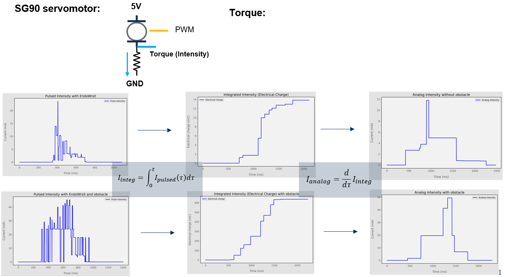
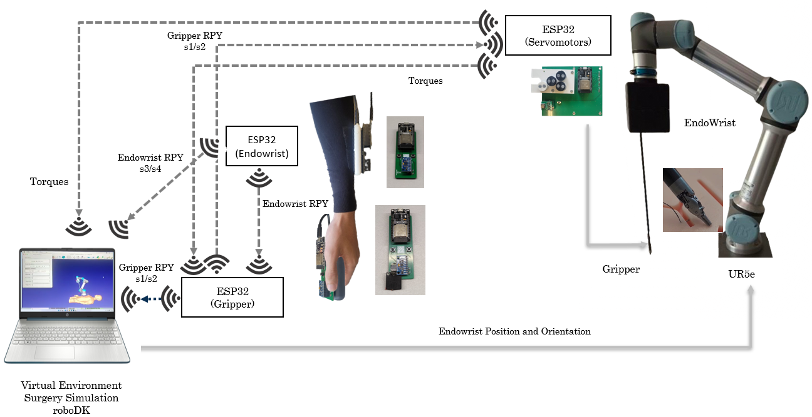

## Degree in Biomedical Engineering
## ROBOTICS AND CONTROL OF BIOMEDICAL SYSTEMS
# **Surgery Robotics Project**
### Laboratory sessions 3 & 4: Biorobotics Laboratory Surgery Robotic system Project improvements

---

In the previous session you have seen the main performances of your first prototype of a DaVinci surgery system.

You have seen the complexity to perform a simple surgery process in roboDK simulation environment.

### The objective of this laboratory session will be:
- Identify the main limitation performances of your first prototype
- Propose and design useful solutions to improve the system
- Implement your own improved surgical robotic system
- Verify the improvements in the system performances for the same surgical process in roboDK simulation environment

### Proposed improvements for Surgery Robotic system prototype in Biorobotcs Lab

The main improvements are based on:
- Servomotors module:
    - apply the RPY angles to the four servomotors to obtain the desired Gripper orientation.
    - read the torques on the four servomotors to detect the gripper contact with the tissue.
    - send these torques to the Gripper module and PC.
    
    
    

- Endowrist module:
    - send RPY angles to Gripper module
- Gripper module:
    - receives the RPY angles from Endowrist module and correct the gripper orientation
    - receives the torques from the Servomotors module.
    - Apply a vibration with actuator to feel the contact with the tissue.
        - You have to add on void setup() the following code:
        ```cpp
        // Configure PWM for the vibration motor (channel 0)
        ledcSetup(0, 5000, 8); // Channel 0, frequency 5kHz, resolution 8 bits
        ledcAttachPin(vibrationPin, 0); // Attach the vibration motor to channel 0
        ````
        - You have to add on void receiveTorquesUDP() the following code:
        ```cpp
        // Vibration motor control based on torque values
        float totalTorque = Torque_roll1 + Torque_pitch + Torque_yaw;
        // Convert torque to PWM value (0-255)
        int vibrationValue = constrain(totalTorque * 2.5, 0, 255); // Adjust the scaling factor as needed
        ledcWrite(0, vibrationValue); // Set the PWM value for the vibration motor
        Serial.print("Vibration motor value: ");
        Serial.println(vibrationValue); 
        ```
- PC module:
    - receives the RPY corrected angles from the Gripper module and perform the simulated gripper orientation
    - receives the RPY angles from the Endowrist module and apply them to the UR5e robot arm with a proper python based sockets program
    - receives the torques from the Servomotors module and apply a color code and write the numeric values
    


### Laboratory sessions: Tasks

The proposed tasks for this first session are:
- Connect properly the Hardware setup
- Save the ESP32 custom Programs for the 3 ESP32 modules using PlatformIO. Take care about the proper IP address of each module and PC.
- Run the InitSurgeryRobotic_students.rdk file in the roboDK program to visualize the UR5e robot arm and the Endowrist tool.
- Test the system performances described above 
- Try to perform again the suture process in simulation according to the following video:
[](https://youtu.be/1t3-Ggcp_Hg?feature=shared)

Show and explain the system performances to your teacher.

### Project Presentation

Each Laboratory group has up to 10 minutes project presentation with:

- Project presentation: with some slides summarising what you have learned and what you have done in this project
- Software and Hardware live demonstration of the assistive robotic tasks designed in the previous session.
- All the students have to contribute to the final presentation