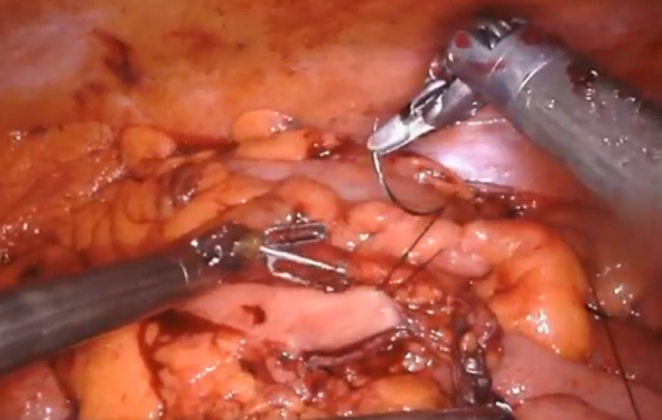

## Degree in Biomedical Engineering
## ROBOTICS AND CONTROL OF BIOMEDICAL SYSTEMS
# **Surgery Robotics Project**
### Laboratory session 1: DaVinci surgery system prototype setup and performances

---

The DaVinci Surgical System is a sophisticated robotic platform that enhances the capabilities of surgeons, enabling them to perform complex, minimally invasive procedures with greater precision and control. 

DaVinci Surgical System is a master-slave system that translates the surgeon's hand movements into the precise actions of miniaturized instruments inside the patient's body. 

The system consists of three main components: 
- a surgeon's console, 
- a patient-side cart with four robotic arms, 
- and a high-definition 3D vision system.

From the ergonomic console, the surgeon views a magnified, high-resolution 3D image of the surgical site, providing a level of detail impossible with the naked eye. 

The surgeon's hand, wrist, and finger movements are translated in real-time to the robotic arms. This technology filters out any hand tremors and scales the surgeon's movements. 

By facilitating smaller incisions, the DaVinci system aims to reduce pain and blood loss, shorten recovery times, and minimize scarring compared to traditional open surgery. It is utilized across a wide range of specialties, including urology, gynecology, and general surgery.

### The objective of this laboratory session will be:
- Develop a simpler prototype of DaVinci system in our Biorobotic's Lab facilities
- Identify the main needed sensors and actuators needed
- Start with a simple Surgery robotic maneobrability GUI interface
- Identify limitation performances and find useful solutions
- Implement your own improved surgical robotic system

Review this video to see the main performances of a DaVinci surgery system:

Review this video to see a Surgeon training suture process:

Review this video to see an exemple of your final project demonstration:

