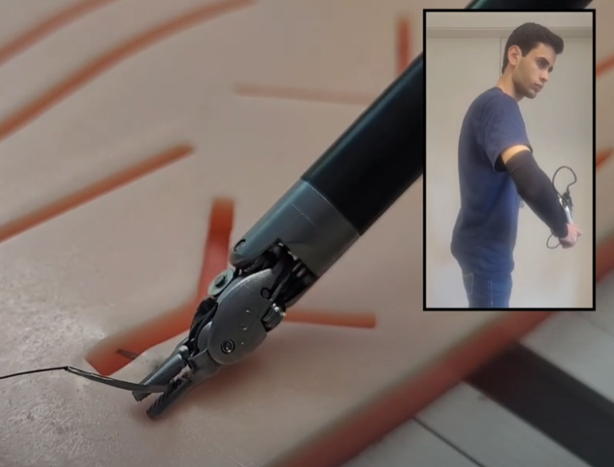

# Bachelor's Degree in Biomedical Engineering
## ROBOTICS AND CONTROL OF BIOMEDICAL SYSTEMS
### Robotic arm Universal Robot UR5e
### Laboratory session 1: Online programming

---

Universal Robots is a very reputed robotic company distributing collaborative robots for industrial, research and academic fields.

### The objective of this laboratory session will be:
- Learn the basic concepts of the Universal Robot UR5e.

Review this training suture process

DaVinci surgery system

